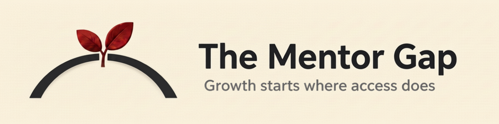

# The Mentor Gap

**Growth starts where access does**

_Project in development_



## About

A mentor changes the shape of someone's career, and most people who never get one simply never had access to someone who could guide them. The Mentor Gap works on that problem from both sides. It gives mentees who don't have access to a human mentor a free, structured way to build their own AI mentor. It also gives people who want to mentor but don't know how to start the confidence and tools to become capable mentors.

This is not a replacement for human mentorship. It's built for people who currently have none, on either side of the relationship.

## What's inside

Two free, self-serve guide tracks for setting up an AI mentor on Claude.ai:

- **Virtual AI Mentor series** (mentee track), guides for mentees in underserved regions without access to a human mentor.
- **Mentor Starter Kit** (mentor track), a guide for people who want to mentor but don't know how to start.

## Tech stack

Built with [Hugo](https://gohugo.io/) and the [Blowfish](https://blowfish.page/) theme (included as a git submodule). Deployed via AWS Amplify.

To run locally:

```bash
git clone --recurse-submodules https://github.com/thementorgap/thementorgap.git
cd thementorgap
hugo server
```

## Repository structure

```
content/
  about/       site's About section
  ai-mentor/   Virtual AI Mentor series (mentee track)
  starter-kit/ Mentor Starter Kit (mentor track)
```

## License

The site's code and configuration are licensed under MIT, see [LICENSE](LICENSE).

The guides and written content in `/content` are licensed under CC BY-NC-SA 4.0, see [LICENSE-CONTENT.md](LICENSE-CONTENT.md). Free to share and adapt, including translation, with attribution, for noncommercial use, under the same license.

## About the founder

Built by Suzana Melo, a full-stack developer and AWS Cloud Practitioner who
transitioned into software development in her 40s without a tech
background. She holds a bachelor's degree in Communications and has
over 20 years of experience. As a strong advocate for diversity and
inclusion, she actively works on initiatives that empower women and
underrepresented groups in tech, mentors juniors and graduates, and
drives tech community enablement across Europe, West Asia, Africa,
Asia-Pacific, and the Americas.

Suzana is an AWS Community Builder, founder of the AWS Women's User
Group Sweden, and co-organizer of AWS Community Day Baltic. She is
enrolled in a postgraduate specialization in AI and Machine Learning
at PUC Minas, is a featured speaker at AWS re:Invent 2024, and writes
articles reaching 14,000+ readers.

- [suzanamelo.com](https://suzanamelo.com/)
- [LinkedIn](https://linkedin.com/in/suzanamelo-m)
